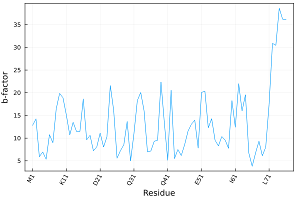

# Some auxiliary functions to quickly retrieve some data 

## Get the protein sequence

To obtain a list of the residue names of the protein with three- and one-letter codes, use
```julia-repl
julia> seq = getseq("file.pdb")
76-element Vector{String}:
 "V"
 "K"
  ⋮      
 "R"
 "G"

```

Use `getseq(atoms,code=2)` to get the sequence as three-letter residue codes, or `code=3` to get 
full natural-aminoacid names, like "Alanine", "Proline", etc.

!!! note
    If there is some non-standard protein residue in the sequence,
    inform the `getseq` function by adding a selection:
    ```julia-repl
    julia> getseq("file.pdb","protein or resname NEW")
    77-element Vector{String}:
     "V"
     "N"
      ⋮      
     "R"
     "G"
    ```
    By default the selection will only return the sequence of natural amino acids. 

The `getseq` function can of course be used on an `Atom` list, accepts selections as the
last argument, as well as the reading and writing functions:

```julia
atoms = readPDB("file.pdb")
seq = getseq(atoms,"chain A")

```

## Distance between sets of atoms

The distance between atoms, or sets of atoms, can be computed with the `distance` function. This
function returns the *minimum distance* between the atoms of the sets involved. For example:

```julia-repl
julia> model = wget("1BSX");

julia> protein = select(model,"protein");

julia> ligand = select(model,"resname T3");

julia> distance(protein,ligand)
2.7775834820937417
  
```

## Closest atoms and their distance

A function similar to the one above is `closest`, which returns the shortest distance between atoms
but also the identity of the atom or pair of atoms that satisfy that shortest distance:

```julia-repl
julia> model = wget("1BSX");

julia> protein = select(model,"protein");

julia> ligand = select(model,"resname T3");

julia> closest(ligand,protein)
(43, 3684, 2.7775834820937417)

julia> ligand[43]
    4037   O1      T3     B        2      512  -22.568   81.625    3.159 36.59  1.00     1       -      4041

julia> protein[3684]
    3684  NE2     HIS     B      435      472  -21.539   82.145    5.686 44.44  1.00     1       -      3686

julia> distance(ligand[43],protein[3684])
2.7775834820937417
  
```

## Obtain arrays with coordinates

All atoms:

```julia-repl
julia> x = coor(atoms)
1463-element Vector{SVector{3, Float64}}:
 [-9.229, -14.861, -5.481]
 [-10.048, -15.427, -5.569]
 [-9.488, -13.913, -5.295]
 ⋮
 [5.772, -10.399, -8.044]
 [6.408, -12.034, -8.343]
 [6.017, -10.967, -9.713]

```

Or use selections to retrieve the coordinates of subsets of atoms:

C``\alpha`` coordinates:

```julia-repl
julia> xCA = coor(protein,"name CA")
104-element Vector{SVector{3, Float64}}:
 [-8.483, -14.912, -6.726]
 [-5.113, -13.737, -5.466]
 [-3.903, -11.262, -8.062]
 ⋮
 7.836, -2.933, -6.873]
 [4.414, -4.302, -7.734]
 [4.134, -7.811, -6.344]
 [3.244, -10.715, -8.603]

```

The coordinates are output as arrays of static arrays (more specifically, as a `Vector{SVector{3,Float64}}`, from `StaticArrays`). 

## Maximum and minimum coordinates of the atoms

Use `maxmin(atoms)`, or `maxmin(atoms,"resname CA")`, for example:

```julia-repl
julia> m = maxmin(atoms,"chain A")

 Minimum atom coordinates: xmin = [-41.5, -41.526, -41.517]
 Maximum atom coordinates: xmax = [41.583, 41.502, 41.183]
 Length in each direction: xlength = [83.083, 83.028, 82.7]

```

`m` is a structure containing the three vectors with minimum and maximum
coordinates, and lengths.

## Residue tick labels for plots

The `residue_ticks` function provides a practical way to define tick labels in plots associated to an amino-acid sequence:

```julia
residue_ticks(
    atoms::AbstractVector{<:Atom}; 
    first=nothing, last=nothing, stride=1, oneletter=true
)
```

The function returns a tuple with residue numbers and residue names for the given atoms, to be used as tick labels in plots.

`first` and `last` optional keyword parameters are integers that refer to the residue numbers to be included. 
The `stride` option can be used to skip residues and declutter the tick labels.

If `oneletter` is `false`, three-letter residue codes are returned. Residues with unknown names will be 
named `X` or `XXX`. 

### Example

Here we illustrate how to plot the average temperature factor of each residue of a crystallographic model as function of the residues.

```julia-repl
julia> using PDBTools, Plots

julia> atoms = wget("1UBQ", "protein");

julia> residue_ticks(atoms; stride=10) # example of output
([1, 11, 21, 31, 41, 51, 61, 71], ["M1", "K11", "D21", "Q31", "Q41", "E51", "I61", "L71"])

julia> plot(
           resnum.(eachresidue(atoms)), # x-axis: residue numbers
           [ mean(beta.(res)) for res in eachresidue(atoms) ], # y-axis: average b-factor per residue
           xlabel="Residue", 
           xticks=residue_ticks(atoms; stride=10), # here we define the x-tick labels
           ylabel="b-factor", 
           xrotation=60,
           label=nothing, framestyle=:box,
      )
```

Produces the following plot:




